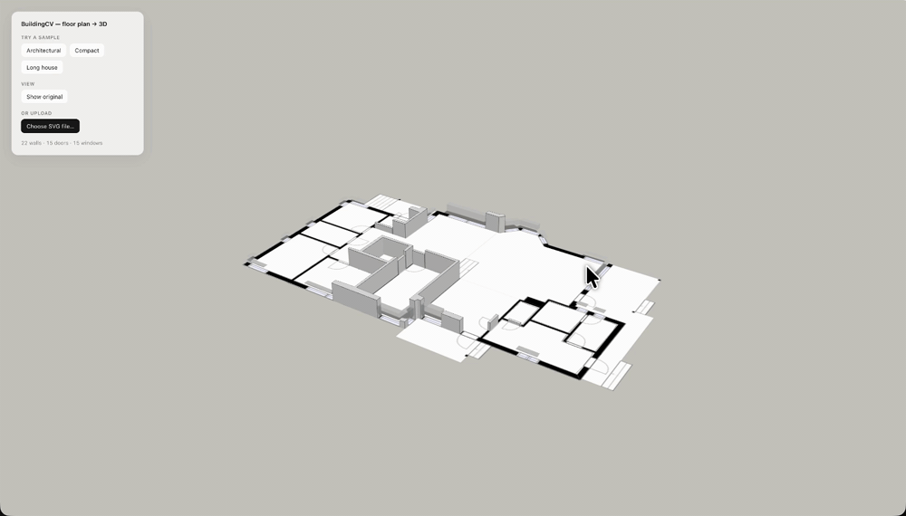

# Floorplan to 3D



Floor-plan structure extraction. A ResNet-UNet trained on [CubiCasa5K](https://github.com/CubiCasa/CubiCasa5k) segments each pixel of an architectural drawing into wall / door / window / floor; a small browser viewer extrudes those predictions into 3D walls, doors, and windows you can orbit around.

**Hosted preview:** [floorplan-to-3d.pages.dev](https://floorplan-to-3d.pages.dev) — three pre-rendered example plans, no backend. To run inference on your own SVGs, follow "Try it locally" below.

## Prerequisites

- **Python 3.11+** (the project pins 3.11.9 via `.python-version`).
- **Cairo** — needed by `cairosvg` to rasterize the input SVGs. `pip` won't install this; grab it from your system package manager:
  - macOS: `brew install cairo`
  - Debian/Ubuntu: `sudo apt install libcairo2`
- A GPU is **not** required for inference. The server runs on CPU; `BUILDINGCV_DEVICE=cuda` (or `mps`) picks a different backend if available.

## Try it locally

```bash
git clone https://github.com/Yytsi/floorplan-to-3d
cd floorplan-to-3d

python -m venv .venv && source .venv/bin/activate
pip install -e ".[serve]"

# Download the trained weights.
mkdir -p weights
curl -L -o weights/best.safetensors https://huggingface.co/Yytsi/floorplan-to-3d-walls/resolve/main/best.safetensors
curl -L -o weights/config.yaml      https://huggingface.co/Yytsi/floorplan-to-3d-walls/resolve/main/config.yaml

./dev.sh   # http://localhost:8000
```

The local viewer adds an "upload SVG" button on top of the three demo plans, so you can drop in any [CubiCasa5K](https://github.com/CubiCasa/CubiCasa5k) `model.svg` and see the model run live.

## How it works

- **Segmentation.** UNet with a pretrained ResNet-34 encoder, 4 output classes (`floor`, `wall`, `door`, `window`). Trained at 512×512 with aspect-preserving letterboxing so non-square plans aren't stretched. See [`src/buildingcv/model.py`](src/buildingcv/model.py) and [`src/buildingcv/train.py`](src/buildingcv/train.py).
- **Polygon extraction.** Per class: morphological closing → `cv2.findContours` (CCOMP, so each wall ring keeps its doorway holes) → Douglas–Peucker simplification → drop sub-threshold speckle. See [`src/buildingcv/extract_polygons.py`](src/buildingcv/extract_polygons.py).
- **3D viewer.** A single-file Three.js page that extrudes each polygon to its class height (walls full, doors shorter, windows as glass slabs between sill and lintel) and animates them rising from the input plan. See [`viewer/index.html`](viewer/index.html).

## Training

```bash
pip install -e ".[train]"
python -m buildingcv.train --config configs/default.yaml
```

Configs live in [`configs/`](configs); each run writes a timestamped dir under `runs/` with `best.pt`, `last.pt`, `metrics.csv`, and `train.log`. Resume with `--resume runs/.../last.pt`.

To regenerate the static-site demos after retraining:

```bash
python scripts/build_demos.py    # writes viewer/demos/{key}.json
```

## Layout

```
src/buildingcv/      # model, training, polygon extraction
server/              # FastAPI inference server (used by ./dev.sh)
viewer/              # Three.js 3D viewer + prebuilt demos
scripts/             # build_demos.py
configs/             # YAML training configs
```
